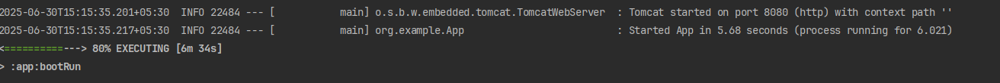

# TrackSafe Auth : Authentication Module for Expense Tracker

---

## Overview

TrackSafe Auth is a standalone authentication microservice built using Spring Boot and Spring Security. It provides user registration and login functionality secured by JWT-based authentication and refresh tokens. This service is designed to be integrated into larger systems like an expense tracker or any microservices-based backend.

It ensures secure access control through stateless session management, encrypted password storage, and role-based authorization.

---

## Features

- User registration with validation for email format and password strength
- Login authentication using username and password
- JWT access token generation for stateless authentication
- Refresh token support to avoid repeated logins
- Role-based access support using many-to-many mapping
- Secure password encryption using BCrypt

---

## Tech Stack

- Java
- Spring Boot
- Spring Security
- JWT (JSON Web Token)
- Hibernate (JPA)
- MySQL (Relational Database)
- REST APIs

---

## Diagrams

### Sequence UML Diagram

### ER Diagram

---

## Explanation of Modules and Flow

**1. SecurityConfig**  
Defines the security rules, creates required beans, and applies the custom JWT filter to incoming HTTP requests. Public endpoints like `/auth/v1/login`, `/auth/v1/signup`, and `/auth/v1/refreshToken` are exempt from filtering.

**2. JwtAuthFilter**  
A custom filter that intercepts requests to validate the presence and validity of a JWT. If valid, it sets the security context for the user.

**3. AuthController**  
Provides the `/auth/v1/signup` endpoint to allow new users to register. On successful registration, both an access token and refresh token are returned.

**4. TokenController**  
Handles `/auth/v1/login` and `/auth/v1/refreshToken`. These endpoints authenticate users and issue or refresh tokens as needed.

**5. JWTService**  
Encapsulates logic for generating JWTs, validating tokens, extracting username and expiration date, and signing tokens with a secret key.

**6. RefreshTokenService**  
Creates new refresh tokens linked to user entities. Validates and expires tokens based on defined lifetime. Handles token cleanup when expired.

**7. UserDetailsServiceImpl**  
Implements Spring Security's `UserDetailsService`. Responsible for signing up new users, checking for existing ones, and loading users during authentication.

**8. CustomUserDetails**  
Wraps `UserInfo` entity and exposes it through Spring Security’s `UserDetails` interface for compatibility with authentication mechanisms.

**9. ValidationUtil**  
Performs format validation for email addresses and ensures that passwords meet minimum security criteria (length, character mix).

**10. Database Layer**  
JPA entities (`UserInfo`, `UserRole`, `RefreshToken`) are mapped to MySQL tables using annotations. The service uses repositories to persist and query user and token data.

---

## How to Run?
### Step 1
- `./gradlew clean build -x test`
- `./gradlew bootRun`
This is start Tomcat at port 8080.

### Step 2: Test different handlers using Postman

## Summary

TrackSafe Auth is a secure, stateless, and extensible authentication backend designed using modern Java and Spring Boot practices. Its modular structure, robust token handling, and clean database schema make it suitable for integration into scalable web or microservices-based applications.
